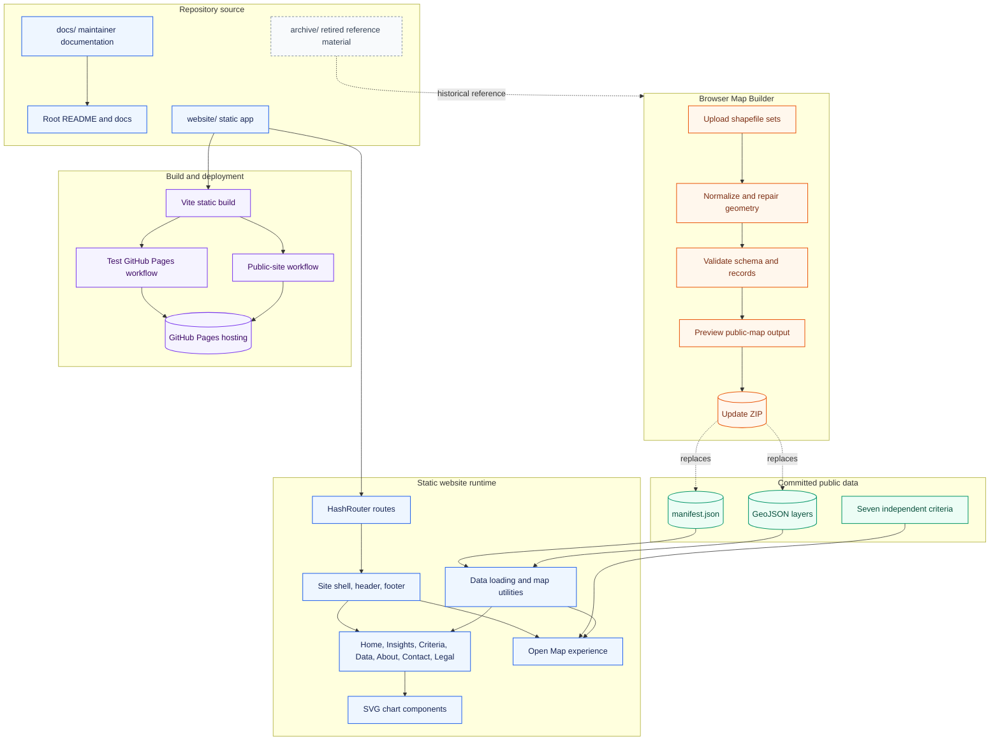

# INDOT Solar Suitability Map

Static public website for the **INDOT Solar Suitability Map** research project, also referenced as **SPR 4862 / Indiana Solar Roadmap**. The site supports transparent screening of candidate sites, INDOT facilities, and right-of-way parcels using individual solar suitability criteria.

The active application lives in [`website/`](website/). It is a React + Vite + Leaflet site that deploys as static files on GitHub Pages. It also includes a browser-based **Map Builder** for validating new shapefile datasets and exporting drop-in static data updates.

Test deployment:

```text
https://kamrul28890.github.io/InDOT-Solar-Suitability-Map-2/
```

Production deployment settings are kept separate from the test workflow.

## What This Project Provides

- A multi-page public website for the INDOT solar suitability screening map.
- A full-screen interactive map with search, layer controls, basemap controls, filters, share links, site details, and individual criterion coloring.
- An Insights page with hand-built SVG/statistical views for district, site type, score, and geographic summaries.
- Criteria, Data, About, Contact, FAQ, Citation, Accessibility, and Disclaimer pages.
- A static-data runtime that loads GeoJSON and manifest files from `website/data/processed/`.
- An in-browser Map Builder for uploading the three project shapefile datasets, reviewing/editing attributes, validating output, previewing the map, and exporting an update ZIP.
- GitHub Actions workflows for test Pages deployment and public-site publishing.

The site does **not** use a backend in production. All public runtime data is static and loaded in the browser.

## Architecture



More detail: [docs/architecture.md](docs/architecture.md).

## Repository Layout

```text
.
|-- website/                 # Active React + Vite + Leaflet website
|   |-- src/                 # Routes, map UI, builder, utilities, styles
|   |-- data/processed/      # Static manifest and GeoJSON loaded by the site
|   |-- public/              # Static public assets served by Vite
|   |-- scripts/             # Build, export, and validation helpers
|   |-- docs/                # Website-local technical notes
|   `-- tests/               # Python API/export tests for local tooling
|-- docs/                    # Maintainer and project documentation
|-- scripts/                 # Root-level maintenance helpers
|-- archive/                 # Retired reference apps and generated local leftovers
|-- .github/workflows/       # GitHub Actions build/deploy workflows
`-- README.md
```

Archived material is kept for reference only. The current website source is `website/`.

## Public Website Routes

The app uses `HashRouter`, so routes work on GitHub Pages without server rewrite rules.

```text
/#/              Home
/#/map           Full interactive map
/#/insights      Summary statistics and charts
/#/criteria      Suitability criteria descriptions
/#/data          Data access and downloads
/#/about         Project overview
/#/contact       Contact form and project contacts
/#/faq           Frequently asked questions
/#/builder       Browser Map Builder
```

Legacy route redirects are kept for compatibility:

```text
/#/methodology -> /#/criteria
/#/editor      -> /#/builder
```

## Suitability Criteria

The website presents seven independent criteria. It does not publish or calculate a composite, mean, or overall suitability score.

| Field | Label | Meaning |
| --- | --- | --- |
| `sol_s` | Solar radiation | Incoming solar resource suitability |
| `slp_s` | Slope | Terrain steepness suitability |
| `trn_s` | Transmission access | Proximity/access suitability |
| `evp_s` | Evapotranspiration | Climatic water-demand factor |
| `dem_s` | Elevation / terrain | Elevation suitability |
| `fld_s` | Flood risk | Flood-zone exposure suitability |
| `lc_s` | Land cover | Land-use / land-cover suitability |

Map coloring can be set to one criterion at a time. The default map view uses a single neutral site color rather than a criterion gradient.

## Run Locally

Prerequisites:

- Node.js 20 or newer
- npm
- PowerShell for the existing Pages preparation script

Install and run:

```powershell
cd website
npm install
npm run dev
```

Open:

```text
http://127.0.0.1:5173/
```

## Build and Test

Run unit tests:

```powershell
cd website
npm test
```

Build the test GitHub Pages artifact:

```powershell
cd website
$env:VITE_DATA_MODE='static'
$env:VITE_PUBLIC_BASE='/InDOT-Solar-Suitability-Map-2/'
npm run publish:ready
```

Build the public-project artifact:

```powershell
cd website
$env:VITE_DATA_MODE='static'
$env:VITE_PUBLIC_BASE='/indot-solar-suitability-map/'
npm run publish:ready
```

The static artifact is written to:

```text
website/dist/
```

## Map Builder

Open the Map Builder at:

```text
/#/builder
```

It accepts the three known INDOT shapefile datasets:

```text
All_Candidate_Sites_Final
solar_potential_scored_indotfacility
solar_potential_scored_interchange
```

The builder workflow is:

1. Upload the three shapefile sets as ZIP files or loose sidecar files.
2. Review and edit retained attributes in the browser.
3. Validate schema, records, and geometry.
4. Preview the normalized public-map output.
5. Export an update ZIP containing `data/processed/manifest.json` and the GeoJSON layers.

Detailed instructions: [docs/map-builder.md](docs/map-builder.md).

## Updating Website Data

Processed public data lives in:

```text
website/data/processed/
```

The Map Builder export ZIP mirrors that folder structure:

```text
data/processed/manifest.json
data/processed/all_candidate_sites.geojson
data/processed/facility_scored.geojson
data/processed/row_scored.geojson
```

To apply an extracted update package locally:

```powershell
.\scripts\apply_update_package.ps1 -PackagePath .\path\to\extracted-update-package
```

Then verify:

```powershell
cd website
npm test
$env:VITE_DATA_MODE='static'
$env:VITE_PUBLIC_BASE='/InDOT-Solar-Suitability-Map-2/'
npm run publish:ready
```

Full update guide: [docs/data-updates.md](docs/data-updates.md).

## Deployment

Two workflows are present:

| Workflow | Purpose |
| --- | --- |
| `.github/workflows/deploy-test-pages.yml` | Builds and deploys this repository to the test GitHub Pages URL. |
| `.github/workflows/deploy-public-site.yml` | Builds from `website/` and publishes to the configured public website repository when `PUBLIC_SITE_DEPLOY_TOKEN` is available. |

The public workflow uses:

```text
VITE_PUBLIC_BASE=/indot-solar-suitability-map/
```

The test workflow uses:

```text
VITE_PUBLIC_BASE=/InDOT-Solar-Suitability-Map-2/
```

Use the base path that matches the target GitHub Pages repository name.

## Key Implementation Notes

- Production is fully static: no server, database, or API is required after build.
- All public data and asset paths go through Vite's base path handling.
- Browser routes use hash fragments for GitHub Pages compatibility.
- The Map Builder runs client-side; uploaded shapefiles are not sent to a server by this app.
- Large/generated folders such as `website/dist/`, local browser traces, and archived nested repositories are ignored.
- Local FastAPI files in `website/app/` remain for development/offline packaging workflows, not for the published static site.

## Documentation Index

- [Architecture](docs/architecture.md)
- [Map Builder operation](docs/map-builder.md)
- [Working with new shapefile datasets](docs/data-updates.md)
- [Deployment notes](docs/deployment/README.md)
- [Website data contract](website/docs/data_contract.md)
- [Website testing notes](website/docs/testing.md)

## Maintainer Checklist

Before pushing a public data or website update:

1. Confirm the target repository and base path.
2. Run `npm test` inside `website/`.
3. Run `npm run publish:ready` with the correct `VITE_PUBLIC_BASE`.
4. Smoke-test the local static artifact if the change affects routing, assets, map behavior, or data loading.
5. Review changed files and avoid committing local generated artifacts.
