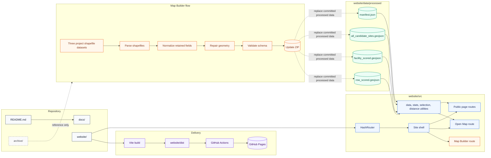

# Project Architecture

This repository contains a static public website and a browser-based data update workflow for the INDOT Solar Suitability Map. The production site is designed to run on GitHub Pages without a backend.

## System Diagram



## Runtime Boundary

The published site is static. It loads:

- compiled JavaScript and CSS from `website/dist/assets/`
- public brand assets from `website/public/`
- `manifest.json` and GeoJSON from `website/data/processed/`

No production server is required. The app uses hash-based routes such as `/#/map` so GitHub Pages can serve every route from a single `index.html`.

## Data Boundary

The public map consumes only processed GeoJSON and manifest files. Source shapefiles are not required at runtime.

The committed processed data files are:

```text
website/data/processed/manifest.json
website/data/processed/all_candidate_sites.geojson
website/data/processed/facility_scored.geojson
website/data/processed/row_scored.geojson
```

The map uses the seven individual criterion fields when present:

```text
sol_s, slp_s, trn_s, evp_s, dem_s, fld_s, lc_s
```

There is no composite/mean/overall suitability score in the public UI.

## Map Builder Boundary

The Map Builder is part of the static site and runs in the browser. It:

- accepts the three known project shapefile datasets
- parses ZIP files or loose shapefile sidecar files
- normalizes retained fields according to `website/src/builder/config/schema.js`
- repairs geometry where possible
- validates records and manifest metadata
- exports a ZIP that mirrors `website/data/processed/`

The builder is not a general GIS editing system. It is intentionally constrained to the known project datasets so the public site data contract stays stable.

## Deployment Boundary

The build command is run inside `website/`:

```powershell
npm run publish:ready
```

`VITE_PUBLIC_BASE` must match the deployment path:

```text
/InDOT-Solar-Suitability-Map-2/      test project site
/indot-solar-suitability-map/        public project site
```

## Archive Boundary

`archive/` contains retired reference material and local legacy tools. It is not the active source for the public website. The active application is `website/`.
