# Working With New Shapefile Data

This guide describes the data update path for maintainers who receive new INDOT shapefile datasets and need to update the static public website.

## Data Flow

```mermaid
flowchart LR
  classDef raw fill:#fff7ed,stroke:#ea580c,color:#7c2d12
  classDef process fill:#eff6ff,stroke:#2563eb,color:#172554
  classDef output fill:#ecfdf5,stroke:#059669,color:#064e3b
  classDef deploy fill:#f5f3ff,stroke:#7c3aed,color:#3b0764

  Raw["New shapefile datasets"]:::raw
  Builder["Map Builder /#/builder"]:::process
  Package[("Update ZIP")]:::output
  Processed["website/data/processed"]:::output
  Checks["npm test and publish:ready"]:::process
  Commit["Commit data changes"]:::deploy
  Pages["GitHub Pages deployment"]:::deploy

  Raw --> Builder --> Package --> Processed --> Checks --> Commit --> Pages
```



## Required Source Datasets

The current data contract expects three source datasets:

| Required dataset | Expected filename stem |
| --- | --- |
| All candidate sites | `All_Candidate_Sites_Final` |
| Scored INDOT facilities | `solar_potential_scored_indotfacility` |
| Scored right-of-way/interchange parcels | `solar_potential_scored_interchange` |

For each dataset, keep the complete shapefile sidecar set when available:

```text
.shp
.dbf
.shx
.prj
.cpg
```

## Retained Public Fields

The Map Builder retains the fields configured in `website/src/builder/config/schema.js`.

Display fields:

```text
SPR_ID
Site_typ
Unit_Site
layer
Volt_Class
Flood_Zone
SlopeMean
Solar_Mean
NTran_DIST
Shape_Area
```

Criterion fields:

```text
sol_s
slp_s
trn_s
evp_s
dem_s
fld_s
lc_s
```

Land-cover fields:

```text
DevOpe_21
DevLowI_22
DDevMed_23
DDevHig_24
DecFor_41
GrasHe_71
OpenW_11
EverFor_42
MixFor_43
SShrub_52
PasHay_81
CultCr_82
welan_90
EmerW_95
Barre_31
```

Provenance field:

```text
source_geometry_valid
```

If a new source dataset changes field names, update the schema and tests deliberately. Do not silently map new fields to old meanings unless the data owner confirms the change.

## Update Procedure

1. Start the local website:

   ```powershell
   cd website
   npm install
   npm run dev
   ```

2. Open:

   ```text
   http://127.0.0.1:5173/#/builder
   ```

3. Upload the three shapefile datasets.

4. Review the Edit step and make only necessary attribute corrections.

5. Run the Validate step and resolve errors.

6. Preview the output.

7. Export the update ZIP.

8. Extract the ZIP to a local folder.

9. From the repository root, apply it:

   ```powershell
   .\scripts\apply_update_package.ps1 -PackagePath .\path\to\extracted-update-package
   ```

10. Verify the changed site:

   ```powershell
   cd website
   npm test
   $env:VITE_DATA_MODE='static'
   $env:VITE_PUBLIC_BASE='/InDOT-Solar-Suitability-Map-2/'
   npm run publish:ready
   ```

11. Review the Git diff. Expected data changes are usually limited to:

   ```text
   website/data/processed/manifest.json
   website/data/processed/all_candidate_sites.geojson
   website/data/processed/facility_scored.geojson
   website/data/processed/row_scored.geojson
   ```

12. Commit and push when the update is approved.

## Validation Expectations

Before publishing, confirm:

- all three processed GeoJSON files exist
- `manifest.json` lists all three layers
- layer record counts match expectations for the new data delivery
- the map route loads without data errors
- the Insights page loads and charts render
- the Map Builder can still parse the same source package if needed
- no generated local folders such as `website/dist/` are committed

## Deployment Base Paths

Use the base path for the target site:

| Target | `VITE_PUBLIC_BASE` |
| --- | --- |
| Test repo | `/InDOT-Solar-Suitability-Map-2/` |
| Public project site | `/indot-solar-suitability-map/` |

Incorrect base paths are the most common cause of broken CSS, JavaScript, images, or data on GitHub Pages.

## When the Source Dataset Changes Shape

If a future delivery changes filenames, field names, geometry types, or layer meaning:

1. Update `website/src/builder/config/schema.js`.
2. Update relevant tests in `website/src/builder/` and `website/src/utils/`.
3. Rebuild a package through the Map Builder.
4. Verify `website/data/processed/manifest.json` and all three GeoJSON files.
5. Smoke-test the deployed Pages URL after publication.

Use `TODO(confirm)` in docs or UI text when a methodology, source, or interpretation has not been confirmed.
